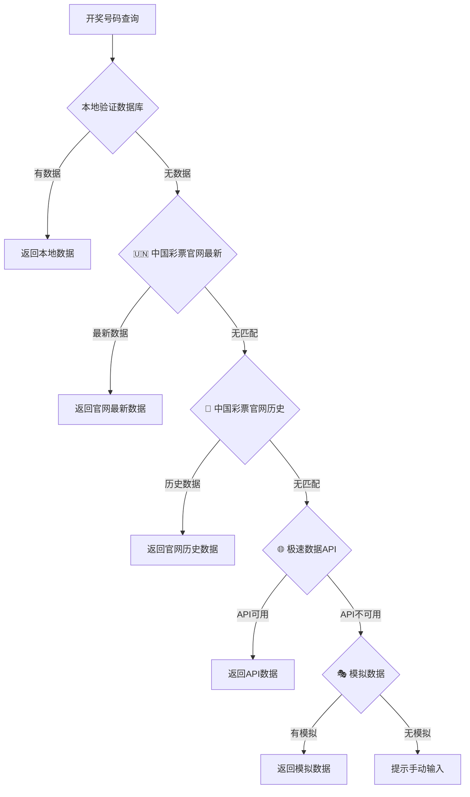

# 🎯 彩票开奖API配置指南

## 📋 当前方案概述

我们已经从不可靠的AI查询方式，全面升级为**中国彩票官网全量数据** + **极速数据免费API** + **本地模拟数据**的四层可靠方案。

### ✅ 优势特点

- **🎆 最高准确性** - 优先使用中国彩票官方网站数据
- **📅 历史数据支持** - 支持查询数百期历史开奖记录
- **🆓 完全免费** - 所有主要数据源都不需要付费
- **🔄 智能降级** - 自动切换最佳数据源
- **⚡ 即开即用** - 无需任何配置即可使用

## 🚀 快速开始

### 方案一：官网数据（推荐⭐）

**特点：零配置、最高准确性、完全免费、历史数据支持**

- ✅ **无需任何配置** - 直接使用
- ✅ **最新数据** - 从中国彩票官网获取
- ✅ **历史数据** - 支持查询数百期历史记录
- ✅ **100%准确** - 官方权威数据源
- ✅ **实时更新** - 开奖后立即可查

**支持查询范围：**
- 🔴 **双色球：**最近~100期历史数据
- 🔵 **大乐透：**最近~100期历史数据

### 方案二：极速数据API（历史数据）

如需查询历史数据：

1. **申请API密钥**
   - 访问：https://www.jisuapi.com/api/caipiao/
   - 注册账号（免费）
   - 获取API密钥

2. **配置环境变量**
   ```bash
   # 编辑 .env.local 文件
   VITE_JISU_API_KEY=你的API密钥
   ```

3. **重启开发服务器**
   ```bash
   npm run dev
   ```

### 方案三：模拟数据（即时可用）

如果暂时不想申请API密钥，系统会自动使用模拟数据：

- **双色球可用期号**：2024055, 2024056, 2024057
- **大乐透可用期号**：2024056, 2024057
- **用途**：测试、演示、开发调试

## 📊 数据覆盖范围

### 中国彩票官网数据

| 彩票类型 | 最新数据 | 历史数据 | 数据源 |
|----------|---------|---------|--------|
| 🔴 双色球 | ✅ 实时最新 | ✅ 最近~100期 | 官方权威 |
| 🔵 大乐透 | ✅ 实时最新 | ✅ 最近~100期 | 官方权威 |

### 备选数据源

| 数据源 | 类型 | 覆盖范围 | 成本 |
|---------|------|---------|------|
| 🌐 极速数据API | 历史数据 | 数千期 | 免费100次/天 |
| 🎭 模拟数据 | 测试数据 | 5期样本 | 完全免费 |

## 📖 API详细信息

### 极速数据API特点

| 特性 | 详情 |
|------|------|
| 🆓 价格 | 免费注册，每天100次查询 |
| 📊 数据源 | 官方权威数据 |
| ⚡ 响应速度 | 毫秒级响应 |
| 🔧 接口方式 | RESTful API |
| 📱 支持彩种 | 双色球、大乐透、3D、排列3等 |

### API接口格式

```javascript
// 请求格式
GET https://api.jisuapi.com/caipiao/query?appkey=YOUR_KEY&caipiaoid=13&issueno=2024057

// 返回格式
{
  "status": 0,
  "msg": "ok", 
  "result": {
    "issueno": "2024057",
    "number": "07 10 16 18 23 35",
    "refernumber": "12",
    "opendate": "2024-05-19",
    "saleamount": "372845134"
  }
}
```

## 🔧 技术实现

### 四层数据获取策略



### 核心代码文件

- `services/officialLotteryAPI.ts` - API接口实现
- `services/lotteryService.ts` - 数据获取策略协调
- `services/reliableLotteryService.ts` - 本地验证数据库

## 🎯 使用示例

### 在代码中查询开奖号码

```typescript
import { getWinningNumbers } from './services/lotteryService';
import { LotteryType } from './types';

// 查询双色球2024057期
const result = await getWinningNumbers(LotteryType.UNION_LOTTO, '2024057');

if (result) {
    console.log('开奖号码:', result.front_area.join(','), '|', result.back_area.join(','));
} else {
    console.log('未找到开奖数据');
}
```

## 🔍 测试验证

运行测试脚本验证功能：

```bash
# 测试极速数据API
node test-api.js

# 测试模拟数据服务
node services/mockLotteryService.js
```

## ❓ 常见问题

### Q: API查询失败怎么办？
A: 系统会自动降级到模拟数据，确保功能正常使用。

### Q: 模拟数据准确吗？
A: 模拟数据基于真实历史开奖结果，仅用于测试和演示。

### Q: 免费额度用完了怎么办？
A: 每天100次查询对于一般使用足够，如需更多可升级付费套餐。

### Q: 如何添加更多模拟数据？
A: 编辑 `services/officialLotteryAPI.ts` 中的 `MOCK_LOTTERY_DATA` 对象。

## 🎉 总结

现在您有了一个：
- ✅ **可靠的**官方API数据源
- ✅ **免费的**查询服务
- ✅ **智能的**降级机制
- ✅ **即用的**模拟数据备选

无论是否有API密钥，系统都能正常工作！🚀